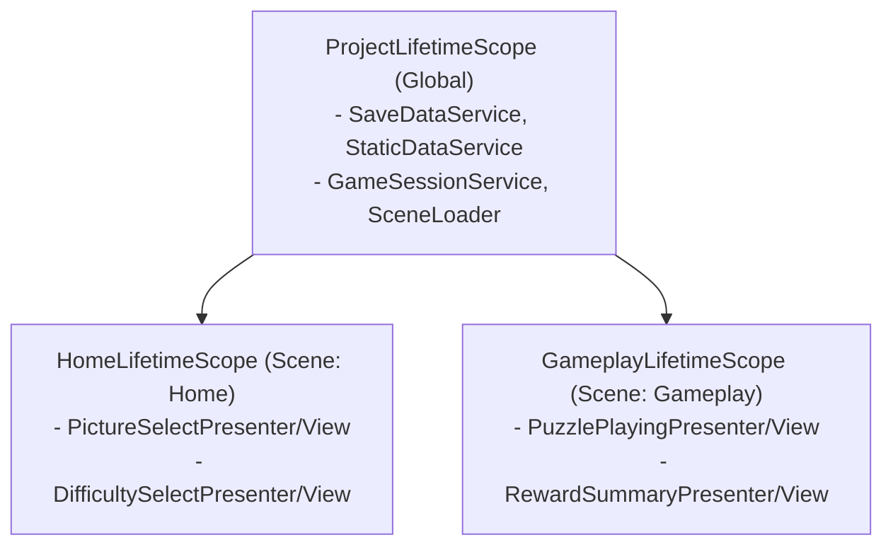
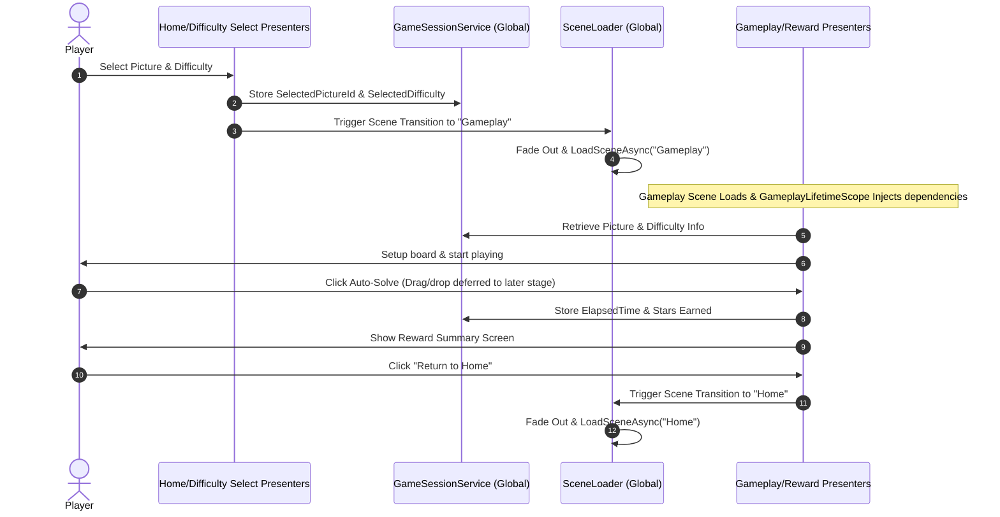

# Thin Vertical Slice Design (2-Scene Architecture)

Date: 2026-06-10

This document defines the technical design for the **Thin Vertical Slice** of Jigsaw Viet Nam. This slice validates the 2-scene architecture, multi-scene dependency injection using `VContainer`, async state control using `UniTask`, and the core progression/save persistence loop.

---

## 1. Architecture Overview

The application is split into two scenes to separate concerns, manage memory effectively, and minimize Git merge conflicts.



* **`Home` Scene:** Handles metadata progression (selecting pictures, choosing difficulties, and in the future: shop, settings, and achievements).
* **`Gameplay` Scene:** Handles the active puzzle session (rendering pictures, tracking elapsed time, and showing completion reward summary).
* **VContainer Multi-Scene Bindings:** To ensure child scene scopes (`HomeLifetimeScope` and `GameplayLifetimeScope`) can resolve dependencies registered in `ProjectLifetimeScope`, the `ProjectLifetimeScope` prefab must be registered in the **VContainerSettings** (under Project Connection). VContainer will then automatically configure it as the global parent scope.

---

## 2. Core Data Models

These models define the configuration and state structures, stored under `Assets/JigsawVina/Scripts/Core/Data/`.

### `PictureConfig` (Immutable Struct)
Defines metadata for a picture.
```csharp
namespace JigsawVina.Core.Data
{
    public readonly struct PictureConfig
    {
        public readonly int Id;
        public readonly string IdString;
        public readonly string DisplayName;
        public readonly string AssetPath;

        public PictureConfig(int id, string idString, string displayName, string assetPath)
        {
            Id = id;
            IdString = idString;
            DisplayName = displayName;
            AssetPath = assetPath;
        }
    }
}
```

### `PlayerSave` & `CompletedPuzzleData` (Classes)
Represents persistent player progress.
```csharp
using System;
using System.Collections.Generic;

namespace JigsawVina.Core.Data
{
    [Serializable]
    public class CompletedPuzzleData
    {
        public int PictureId;
        public int DifficultyId;
        public float BestTimeSeconds;
        public int BestStar;
    }

    [Serializable]
    public class PlayerSave
    {
        public int Coins;
        public int Hints;
        public List<CompletedPuzzleData> CompletedPuzzles = new();
    }
}
```

---

## 3. Dependency Injection (DI) Setup

### Project Scope (`ProjectLifetimeScope.cs`)
Lives in a Prefab registered in `VContainer Settings`. It loads automatically at app start.

* **`IStaticDataService` / `StaticDataService`:** Mock service returning a hardcoded list of pictures. Difficulty details (piece counts, star rewards) are temporarily mapped directly in the presenters for this thin slice to keep data services simple, and will be moved to static data config in the next scope.
* **`ISaveDataService` / `SaveDataService`:** Reads/writes `PlayerSave` to Unity's `PlayerPrefs` as JSON.
* **`GameSessionService`:** Shared state class carrying selected picture/difficulty and completed session stats between scenes.
* **`SceneLoader`:** Handles transition between scene `Home` and scene `Gameplay` asynchronously using `UniTask` and `SceneManager.LoadSceneAsync`.

### Scene Scopes
* **`HomeLifetimeScope.cs` (Attached to a GameObject in `Home.unity`):**
  * Registers `PictureSelectPresenter` and `DifficultySelectPresenter`.
  * Resolves view components that exist in the scene hierarchy (`PictureSelectView`, `DifficultySelectView`) using `RegisterComponentInHierarchy`.
* **`GameplayLifetimeScope.cs` (Attached to a GameObject in `Gameplay.unity`):**
  * Registers `PuzzlePlayingPresenter` and `RewardSummaryPresenter`.
  * Resolves view components that exist in the scene hierarchy (`PuzzlePlayingView`, `RewardSummaryView`) using `RegisterComponentInHierarchy`.

---

## 4. Scene Transition Flow



---

## 5. UI Views & Progression Logic

* **No Interactive Drag & Drop in Thin Slice:** To keep the vertical slice focused on VContainer connection and scene loading, actual drag-and-drop interactions are deferred. The gameplay scene uses a temporary title and a **"Cheat Win"** button to mock puzzle completion.
* **Progression Upsert Logic:** When saving completion records, the save system checks if a record for the current `(PictureId, DifficultyId)` already exists. If it does, the system updates the record only if the new elapsed time is faster or the star count is higher. Otherwise, it inserts a new record.

---

## 6. Verification Plan

### Automated Verification
* Unit tests for `SaveDataService` verifying correct JSON serialization/deserialization.
* Unit tests for `RewardSummaryPresenter` and progression tracking to verify:
  - Stars are calculated correctly for each difficulty.
  - Replaying a level updates/upserts the record instead of creating duplicates.

### Manual Verification
1. Play the `Home` scene. Select picture and choose difficulty. Verify correct scene transitions to `Gameplay`.
2. Verify that the gameplay scene displays the selected picture and difficulty correctly.
3. Click the **Cheat Win** button to trigger completion. Verify reward screen details are correct.
4. Return to `Home` scene. Verify that picture selection states show the updated completion record.
