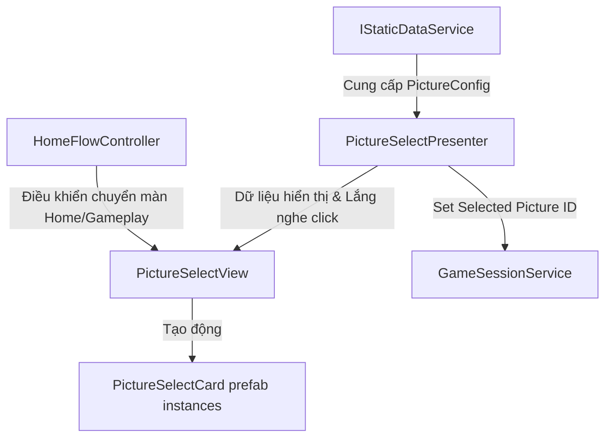

# Thiết kế Home UI kết nối động với Static Data (Cập nhật v6)

Tài liệu này mô tả chi tiết thiết kế chuyển đổi màn hình Home (Lựa chọn tranh) sang danh sách cuộn động hiển thị ảnh xem trước, tải dữ liệu từ `IStaticDataService` và sử dụng Prefab tái sử dụng.

## Mục tiêu thiết kế
* **Động hoàn toàn & Tái sử dụng**: Tự động hiển thị toàn bộ tranh cấu hình trong file JSON static data (5 tranh hoặc nhiều hơn) dưới dạng Scroll View bằng cách nhân bản Prefab `PictureSelectCard`.
* **WOW User**: Mỗi card tranh hiển thị tên tranh kèm ảnh thu nhỏ (thumbnail) được load động.
* **Tối ưu hóa Runtime & Validate sớm**: Không thực hiện validate DB nặng nề ở runtime. Toàn bộ khâu kiểm tra tính hợp lệ được đẩy về Editor-Time và EditMode Tests.
* **An toàn bộ nhớ**: Giải phóng hoàn toàn các đối tượng UI được sinh động khi rebuild danh sách và quản lý vòng đời (lifecycle) sạch cho cả Presenter và FlowController.

---

## Phân chia trách nhiệm (Architecture & Components)



### 1. Component Prefab [PictureSelectCard.cs](file:///d:/soflware/Unity/Source/Jigsaw_ViNa/JigsawVina/Assets/JigsawVina/Scripts/Presentation/Screens/PictureSelectCard.cs)
Component đính kèm trên Prefab `PictureSelectCard.prefab` quản lý trực tiếp giao diện card:
* `[SerializeField] private Button _button;`
* `[SerializeField] private Image _thumbnailImage;` (Thống nhất chỉ dùng Image)
* `[SerializeField] private TMP_Text _displayNameText;`
* **Cơ chế gán sự kiện an toàn (Safe Listener Registration)**: Để tránh làm mất hoặc ghi đè listener mặc định trên nút bấm, lớp này lắng nghe click một lần duy nhất ở `Awake()` và chuyển tiếp sự kiện qua `Action<int>` động.
* **Cơ chế Unbind sạch sẽ**:
  * `Unbind()` ngắt hoàn toàn callback (`_onClicked = null`) và gán `_thumbnailImage.sprite = null` để ngắt tham chiếu đến Sprite, cho phép asset trở thành unused để dọn dẹp khi chuyển cảnh.
  * Các listener nội bộ của Button (đăng ký qua lambda ở `Awake()`) chỉ tham chiếu tới các trường nội bộ của chính Card nên không gây rò rỉ chéo. Chúng sẽ được Unity giải phóng hoàn toàn cùng với Card khi GameObject bị destroy.

### 2. [PictureSelectView.cs](file:///d:/soflware/Unity/Source/Jigsaw_ViNa/JigsawVina/Assets/JigsawVina/Scripts/Presentation/Screens/PictureSelectView.cs)
* Quản lý khung giao diện màn chọn tranh. Tham chiếu trực tiếp đến prefab:
  * `[SerializeField] private PictureSelectCard _cardPrefab;`
  * `[SerializeField] private RectTransform _contentContainer;`
* **Dọn dẹp**: Chỉ gọi dọn dẹp các card con trong `_instantiatedCards` khi gọi `Setup()` (để chuẩn bị vẽ danh sách mới). Khi Scene unload, Unity sẽ tự động giải phóng hierarchy nên không cần dọn dẹp ở `OnDestroy()`.
* **Đóng gói thuộc tính phục vụ Test**: Để tránh mutable object leaks ra ngoài API runtime công khai, View khai báo danh sách là `internal` và kết hợp `InternalsVisibleTo` cấp assembly đặt chính xác sau phần using của tệp:
  ```csharp
  internal IReadOnlyList<PictureSelectCard> InstantiatedCards => _instantiatedCards;
  ```
* **Validation nghiêm ngặt**:
  ```csharp
  if (_cardPrefab == null)
  {
      Debug.LogError("[JigsawVina] UI error: Card Prefab is not assigned on PictureSelectView.");
      return;
  }
  if (_contentContainer == null)
  {
      Debug.LogError("[JigsawVina] UI error: Content Container is not assigned on PictureSelectView.");
      return;
  }
  ```

### 3. [PictureSelectPresenter.cs](file:///d:/soflware/Unity/Source/Jigsaw_ViNa/JigsawVina/Assets/JigsawVina/Scripts/Presentation/Screens/PictureSelectPresenter.cs)
* Lấy danh sách tranh từ `IStaticDataService.GetAllPictures()`. Nếu danh sách trống, log lỗi chi tiết.
* Triển khai `IDisposable` để hủy đăng ký sự kiện với View:
  ```csharp
  public void Dispose()
  {
      if (_view != null)
      {
          _view.OnPictureSelected -= HandlePictureSelected;
      }
  }
  ```

### 4. [HomeFlowController](file:///d:/soflware/Unity/Source/Jigsaw_ViNa/JigsawVina/Assets/JigsawVina/Scripts/Presentation/Screens/HomeLifetimeScope.cs)
* Triển khai `IDisposable` và sử dụng named handler (`HandlePictureSelected`) thay vì lambda để hủy đăng ký sạch sẽ khi scene đóng:
  ```csharp
  public void Dispose()
  {
      if (_pictureSelectView != null)
      {
          _pictureSelectView.OnPictureSelected -= HandlePictureSelected;
      }
  }
  ```

---

## Quản lý Bộ nhớ & Tải tài nguyên
* **Memory Safety**: Giải phóng listener ở cả Presenter và FlowController qua `Dispose()`. Giải phóng card qua `Unbind()` trước khi `Destroy`.
* **Resource Loading**: MVP hiện tại sẽ tải trực tiếp ảnh chính từ `AssetPath`.
* **Unloading**: Không gọi `Resources.UnloadUnusedAssets()` khi chuyển sang Gameplay Scene để tránh hiện tượng đứng hình (frame hitch).
